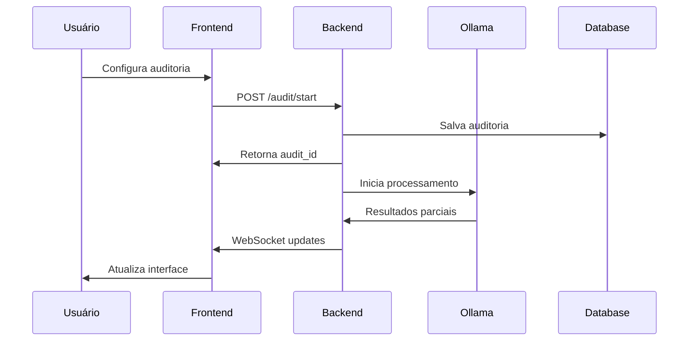
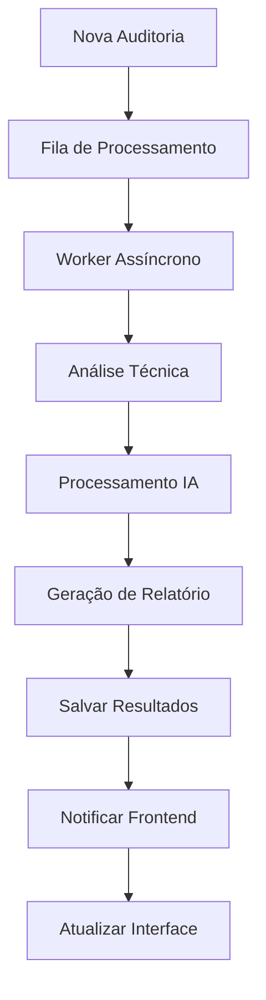

# PRD - Sistema de Auditoria SEO Automatizada

## 📋 Informações do Projeto

- **Nome do Projeto:** Sistema de Auditoria SEO Automatizada
- **Versão:** 1.0.0
- **Data:** Janeiro 2025
- **Tecnologias:** Python 3.11+, Flask, React 18+, TypeScript, WebSockets, Ollama AI
- **Objetivo:** Automatizar auditorias técnicas de SEO com interface web moderna e documentação inteligente

---

## 🎯 Visão Geral

O Sistema de Auditoria SEO Automatizada é uma plataforma completa que combina análise técnica avançada com inteligência artificial para realizar auditorias de SEO de forma automatizada. O sistema oferece uma interface web moderna e intuitiva, processamento assíncrono em tempo real e geração automática de documentação detalhada.

### Principais Diferenciais

- **Interface Web Moderna:** Dashboard responsivo com React e TypeScript
- **Processamento Assíncrono:** Auditorias em background com atualizações em tempo real
- **IA Integrada:** Análise inteligente usando Ollama para insights avançados
- **Documentação Automática:** Geração de relatórios detalhados em Google Docs
- **Monitoramento Completo:** Métricas, logs e alertas em tempo real

---

## 🏗️ Arquitetura do Sistema

### Backend (Flask + Python)

```
/app
├── main.py                 # Aplicação Flask principal
├── seo_audit_agent.py      # Agente de auditoria SEO
├── seo_documentation_agent.py # Agente de documentação
├── doc_agent.py            # Integração Google Docs
├── ollama_client.py        # Cliente Ollama AI
├── websocket_manager.py    # Gerenciamento WebSocket
├── security.py             # Rate limiting e segurança
├── database.py             # Conexão e operações de banco
├── async_processor.py      # Processamento assíncrono
├── report.py               # Geração de relatórios
└── utils/                  # Utilitários e helpers
```

### Frontend (React + TypeScript)

```
/FrontEnd/src
├── components/             # Componentes reutilizáveis
│   ├── Layout.tsx         # Layout principal
│   ├── Header.tsx         # Cabeçalho
│   ├── Sidebar.tsx        # Menu lateral
│   ├── Spinner.tsx        # Loading
│   └── NotificationCenter.tsx # Central de notificações
├── pages/                 # Páginas da aplicação
│   ├── Dashboard.tsx      # Dashboard principal
│   ├── NewAudit.tsx       # Nova auditoria
│   ├── AuditProgress.tsx  # Progresso da auditoria
│   ├── Results.tsx        # Resultados
│   ├── History.tsx        # Histórico
│   ├── AdminPanel.tsx     # Painel administrativo
│   └── Monitoring.tsx     # Monitoramento
├── services/              # Serviços de API
├── store/                 # Gerenciamento de estado (Zustand)
├── hooks/                 # Hooks customizados
└── types/                 # Definições TypeScript
```

---

## 🚀 Funcionalidades Principais

### 1. Dashboard Interativo

- **Visão Geral:** Estatísticas em tempo real de auditorias
- **Gráficos:** Visualização de métricas e tendências
- **Ações Rápidas:** Iniciar nova auditoria, ver resultados recentes
- **Notificações:** Centro de notificações em tempo real

### 2. Sistema de Auditoria

#### Tipos de Auditoria Suportados
- **Auditoria Completa:** Análise técnica abrangente
- **Auditoria de Performance:** Foco em velocidade e Core Web Vitals
- **Auditoria de Conteúdo:** Análise de SEO on-page
- **Auditoria de Acessibilidade:** Verificação de padrões WCAG

#### Processo de Auditoria
1. **Configuração:** URL, tipo de auditoria, parâmetros
2. **Execução:** Processamento assíncrono em background
3. **Análise IA:** Processamento inteligente com Ollama
4. **Documentação:** Geração automática de relatórios
5. **Entrega:** Resultados na interface e Google Docs

### 3. Monitoramento e Métricas

- **Métricas do Sistema:** CPU, memória, disco
- **Métricas de Aplicação:** Auditorias ativas, filas, performance
- **Alertas:** Notificações automáticas para problemas
- **Logs:** Sistema completo de logging com níveis

### 4. Painel Administrativo

- **Gerenciamento de Processos:** Controle de workers assíncronos
- **Cache:** Limpeza e estatísticas de cache
- **Configurações:** Parâmetros do sistema
- **Usuários:** Gerenciamento de acesso (futuro)

---

## 🔧 Especificações Técnicas

### Backend

#### Framework e Dependências
- **Flask 3.0+:** Framework web principal
- **Flask-SocketIO:** WebSockets para tempo real
- **Flask-CORS:** Suporte a CORS
- **SQLite:** Banco de dados local
- **Ollama:** IA local para análise
- **Requests:** Cliente HTTP
- **BeautifulSoup4:** Parsing HTML
- **Pandas:** Manipulação de dados

#### APIs Integradas
- **Google Search Console API:** Dados de performance
- **Google Analytics 4 API:** Métricas de tráfego
- **PageSpeed Insights API:** Métricas de performance
- **Google Docs API:** Geração de documentação

#### Segurança
- **Rate Limiting:** 200 requisições por 60 segundos
- **CORS:** Configurado para desenvolvimento e produção
- **Validação:** Sanitização de entradas
- **Logging:** Auditoria completa de ações

### Frontend

#### Framework e Dependências
- **React 18+:** Framework frontend
- **TypeScript:** Tipagem estática
- **Vite:** Build tool moderno
- **Tailwind CSS:** Framework CSS utilitário
- **Zustand:** Gerenciamento de estado
- **React Router:** Roteamento
- **Socket.IO Client:** WebSockets
- **Axios:** Cliente HTTP

#### Funcionalidades
- **Responsivo:** Design adaptável a todos os dispositivos
- **Tema Escuro/Claro:** Alternância de temas
- **Tempo Real:** Atualizações via WebSocket
- **Offline:** Suporte básico a modo offline
- **PWA Ready:** Preparado para Progressive Web App

---

## 📊 Fluxo de Dados

### 1. Iniciar Auditoria



### 2. Processamento Assíncrono



---

## 🎨 Interface do Usuário

### Design System

#### Cores Principais
- **Primary:** Azul (#3B82F6)
- **Secondary:** Roxo (#8B5CF6)
- **Success:** Verde (#10B981)
- **Warning:** Amarelo (#F59E0B)
- **Error:** Vermelho (#EF4444)

#### Tipografia
- **Display:** Inter (títulos)
- **Body:** Inter (texto)
- **Mono:** JetBrains Mono (código)

#### Componentes
- **Glass Effect:** Efeito de vidro com backdrop-blur
- **Gradients:** Gradientes sutis para profundidade
- **Shadows:** Sombras suaves para elevação
- **Animations:** Transições fluidas

### Páginas Principais

1. **Dashboard**
   - Estatísticas gerais
   - Auditorias recentes
   - Gráficos de performance
   - Ações rápidas

2. **Nova Auditoria**
   - Formulário de configuração
   - Seleção de tipo de auditoria
   - Parâmetros avançados
   - Preview de configuração

3. **Progresso da Auditoria**
   - Barra de progresso em tempo real
   - Log de atividades
   - Controles de pausa/cancelamento
   - Estimativa de tempo

4. **Resultados**
   - Visualização de problemas encontrados
   - Filtros e ordenação
   - Exportação de relatórios
   - Ações de correção

5. **Histórico**
   - Lista de auditorias anteriores
   - Filtros por data/status
   - Comparação entre auditorias
   - Arquivamento

---

## 🔄 Integrações

### APIs Externas

#### Google Search Console
- **Endpoint:** `https://searchconsole.googleapis.com/webmasters/v3/`
- **Dados:** Performance de busca, indexação, problemas
- **Autenticação:** OAuth 2.0

#### Google Analytics 4
- **Endpoint:** `https://analyticsdata.googleapis.com/v1beta/`
- **Dados:** Tráfego, conversões, comportamento
- **Autenticação:** Service Account

#### PageSpeed Insights
- **Endpoint:** `https://pagespeedonline.googleapis.com/pagespeedonline/v5/`
- **Dados:** Core Web Vitals, performance
- **Autenticação:** API Key

#### Google Docs
- **Endpoint:** `https://docs.googleapis.com/v1/`
- **Função:** Geração automática de relatórios
- **Autenticação:** Service Account

### Ollama AI

#### Modelos Suportados
- **llama3.2:3b:** Modelo principal para análise
- **codellama:** Análise de código
- **mistral:** Alternativa para análise

#### Prompts Especializados
- **Auditor SEO:** Análise técnica de problemas
- **Documentador:** Geração de relatórios
- **Consultor:** Recomendações de melhorias

---

## 📈 Métricas e KPIs

### Métricas de Sistema
- **Uptime:** Disponibilidade do sistema
- **Response Time:** Tempo de resposta das APIs
- **Throughput:** Auditorias processadas por hora
- **Error Rate:** Taxa de erro das auditorias

### Métricas de Negócio
- **Auditorias Completadas:** Total de auditorias finalizadas
- **Problemas Identificados:** Número de problemas encontrados
- **Tempo Médio de Auditoria:** Duração média do processamento
- **Taxa de Sucesso:** Percentual de auditorias bem-sucedidas

### Alertas Configurados
- **Sistema Indisponível:** Downtime > 5 minutos
- **Alta Latência:** Response time > 10 segundos
- **Erro de Processamento:** Taxa de erro > 5%
- **Recursos Limitados:** CPU/Memória > 80%

---

## 🚦 Roadmap

### Versão 1.0 (Atual)
- ✅ Interface web completa
- ✅ Sistema de auditoria básico
- ✅ Integração com Ollama
- ✅ WebSockets em tempo real
- ✅ Painel administrativo

### Versão 1.1 (Próxima)
- 🔄 Autenticação de usuários
- 🔄 Múltiplos projetos por usuário
- 🔄 Agendamento de auditorias
- 🔄 Notificações por email

### Versão 1.2 (Futuro)
- 📋 API pública
- 📋 Integração com CI/CD
- 📋 Relatórios customizáveis
- 📋 Dashboard executivo

### Versão 2.0 (Longo Prazo)
- 📋 Multi-tenancy
- 📋 Análise de concorrentes
- 📋 Machine Learning avançado
- 📋 Mobile app

---

## 🛠️ Configuração e Deploy

### Desenvolvimento

#### Pré-requisitos
- Python 3.11+
- Node.js 18+
- Ollama instalado
- Git

#### Configuração Backend
```bash
# Clonar repositório
git clone <repo-url>
cd ProjetoAuditoria

# Instalar dependências
pip install -r requirements.txt

# Configurar variáveis de ambiente
cp .env.example .env

# Executar servidor
python -m app.main
```

#### Configuração Frontend
```bash
# Navegar para frontend
cd FrontEnd

# Instalar dependências
npm install

# Configurar variáveis
cp .env.example .env

# Executar em desenvolvimento
npm run dev
```

### Produção

#### Docker
```bash
# Build da imagem
docker build -t seo-audit-system .

# Executar container
docker run -p 5001:5001 -p 5173:5173 seo-audit-system
```

#### Variáveis de Ambiente
```env
# Backend
FLASK_ENV=production
DATABASE_URL=sqlite:///audit.db
OLLAMA_BASE_URL=http://localhost:11434
GOOGLE_APPLICATION_CREDENTIALS=path/to/credentials.json

# Frontend
VITE_API_BASE_URL=http://localhost:5001
VITE_WS_URL=ws://localhost:5001
```

---

## 🔒 Segurança

### Medidas Implementadas
- **Rate Limiting:** Proteção contra abuso de API
- **Input Validation:** Sanitização de todas as entradas
- **CORS:** Configuração adequada para produção
- **Logging:** Auditoria completa de ações
- **Error Handling:** Tratamento seguro de erros

### Recomendações Futuras
- **HTTPS:** Certificados SSL/TLS
- **Authentication:** JWT ou OAuth 2.0
- **Authorization:** Controle de acesso baseado em roles
- **Encryption:** Criptografia de dados sensíveis
- **Security Headers:** Headers de segurança HTTP

---

## 📚 Documentação Técnica

### APIs Disponíveis

#### Auditoria
- `POST /audit/start` - Iniciar nova auditoria
- `GET /audit/status/{id}` - Status da auditoria
- `GET /audit/results/{id}` - Resultados da auditoria
- `DELETE /audit/{id}` - Cancelar auditoria

#### Sistema
- `GET /health` - Health check
- `GET /metrics` - Métricas do sistema
- `GET /admin/stats` - Estatísticas administrativas

#### WebSocket Events
- `audit_progress` - Progresso da auditoria
- `audit_complete` - Auditoria finalizada
- `system_alert` - Alertas do sistema

### Estrutura de Dados

#### Auditoria
```typescript
interface Audit {
  id: string;
  url: string;
  type: AuditType;
  status: AuditStatus;
  progress: number;
  startTime: string;
  endTime?: string;
  results?: AuditResult[];
}
```

#### Resultado
```typescript
interface AuditResult {
  category: string;
  severity: 'low' | 'medium' | 'high' | 'critical';
  title: string;
  description: string;
  impact: string;
  solution: string;
  evidence: Evidence[];
}
```

---

## 🤝 Contribuição

### Padrões de Código
- **Python:** PEP 8, type hints, docstrings
- **TypeScript:** ESLint, Prettier, strict mode
- **Git:** Conventional commits, feature branches
- **Testes:** Pytest (backend), Jest (frontend)

### Processo de Desenvolvimento
1. **Issue:** Criar issue descrevendo a funcionalidade/bug
2. **Branch:** Criar branch a partir de `develop`
3. **Desenvolvimento:** Implementar com testes
4. **Pull Request:** Criar PR com descrição detalhada
5. **Review:** Code review e aprovação
6. **Merge:** Merge para `develop` e deploy

---

## 📞 Suporte

### Contatos
- **Desenvolvedor:** [Nome do desenvolvedor]
- **Email:** [email@exemplo.com]
- **GitHub:** [github.com/usuario/repo]

### Recursos
- **Documentação:** [link para docs]
- **Issues:** [link para issues do GitHub]
- **Wiki:** [link para wiki]
- **Changelog:** [link para changelog]

---

*Este PRD é um documento vivo e será atualizado conforme a evolução do projeto.*